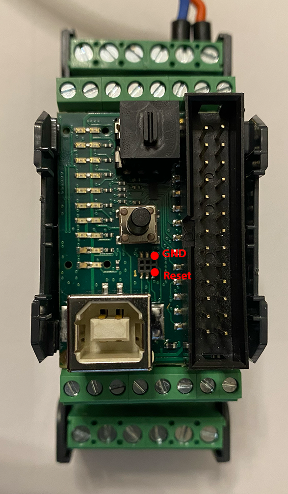

# WPN Keyboard Emulator

## Setup

**Install VSCode**

https://code.visualstudio.com/

**Install the PlatformIO extension**

https://platformio.org/install/ide?install=vscode

**Download and open project**

- Download repository as zip file.
- PIO Home >> Open Project >> keyboard-emulator folder.

**Install a DFU programmer**

Mac: (recommended)

Install MacPorts following these instructions: https://www.macports.org/install.php#pkg

```
sudo port install dfu-programmer
```
Linux:
```
sudo apt-get install dfu-programmer
```

## Install the software on a new device

Unlike other Arduino boards, the Controllino PLCs are usually not able to be recognized as a keyboard. Because of that we have to flash a custom bootloader onto the ATmega16u2 chip. This is a brief guide on how to achieve that. If you run into problems, here is a more detailed description of this progress: https://mitchtech.net/arduino-usb-hid-keyboard/

**Build and Upload firmware**
- Plug in the Controllino PLC.
- Build and upload the PlatformIO project.

**Reset the ATmega16U2 chip**
- Remove the white plastic cover from the Controllino.
- Briefly bridge the reset and ground pins from the ICSP header of the ATmega16u2 chip. These pins are located as shown below:



**Flash the new bootloader**

The boatloader files are located in the "ATmega16u2 firmware" folder.

```
sudo dfu-programmer atmega16u2 erase
sudo dfu-programmer atmega16u2 flash Arduino-keyboard-0.3.hex
sudo dfu-programmer atmega16u2 reset
```

Disconnect and reconnect the Controllino PLC.

## Wiring

A full wiring guide is located in the "Schematics" folder.
